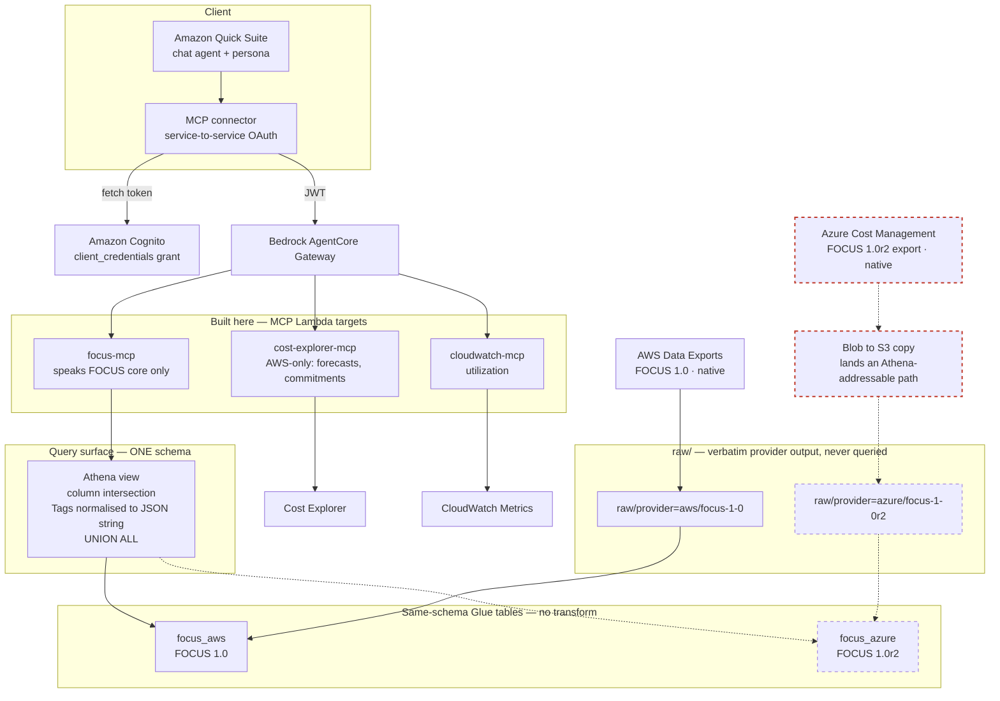

# Design 2 — Option C: FOCUS as a contract, not an ETL project

**Status: PROPOSAL. Not adopted.** `design.md` remains authoritative until a decision is
recorded. This file exists to make Option C concrete enough to accept or reject.

**The question.** `design.md` phase 2 builds a transform job that reads `raw/` from both
providers and writes one curated `focus/` table. That transform must reconcile column
sets, normalise `Tags`, and survive Parquet type differences — against Azure data nobody
here has ever seen. `design.md`'s own deferred-risk section calls the Parquet numeric
types the "highest-consequence unknown" and notes it "fails at read time, not at DDL
time".

Option C keeps the unified query surface but replaces the transform **job** with an
Athena **view**, and makes the Azure export the **customer's** deliverable.

---

## Architecture

Solid = live today. Dashed = phase 2. **Red = customer-owned.**



**The two things this diagram asserts.**

`focus-mcp` touches only the view. It never sees a provider-specific column, so adding
Azure changes no tool and no persona instruction — that is what makes phase 2 additive
instead of a rewrite.

The red boundary is the ask. Everything left of it is ours and works today. Azure export
and the copy into S3 belong to the customer and their Azure expert.

---

## Why a view instead of a job

| | Transform job (design.md) | View (Option C) |
|---|---|---|
| Column intersection | code | explicit `SELECT` list |
| `Tags` type conflict | code normalises both | `CAST` in the view |
| Fixing a type surprise | debug and re-run a job | edit one DDL statement |
| Azure restatement (twice daily, first 5 days) | re-run per restatement | overwrite files, view is instantly correct |
| Moving to FOCUS 1.2 | re-run over `raw/` | edit the view |
| Ops surface | scheduled job, failures, backfills | none |

The decisive point is not elegance. It is that the risk you **cannot close without an
Azure tenant** lands on a declarative artifact rather than on code — and probably lands
while a customer is watching.

## What does NOT change from design.md

- `raw/` still exists, verbatim and never queried. It is cheap and it gives replay.
- `focus-mcp` is still named for the schema it speaks, not the engine it runs on.
- `x_payload` survives as a view column preserving provider extras.
- `cost-explorer-mcp` stays AWS-only for forecasts and commitments — things FOCUS does
  not carry.

## What changes

- No transform component, no schedule, no job to operate.
- Two Glue tables instead of one curated table.
- Azure file relocation happens **inside the copy step you need anyway** — Azure's
  `20260701-20260731/<RunID>/` layout is not Athena-addressable under any design, so this
  is not new work, just work that moves.

## View DDL — shape only, not final

Unverified against real Azure output. Column list is illustrative.

```sql
CREATE OR REPLACE VIEW focus_all AS
SELECT 'aws' AS provider, billing_period, billed_cost, effective_cost,
       service_name, region_id, sub_account_id,
       CAST(json_format(CAST(tags AS JSON)) AS VARCHAR) AS tags_json
FROM   focus_aws
UNION ALL
SELECT 'azure' AS provider, billing_period, billed_cost, effective_cost,
       service_name, region_id, sub_account_id,
       tags AS tags_json
FROM   focus_azure;
```

`tags` is `map<string,string>` on AWS and a JSON string on Azure — the cast is the whole
reconciliation, and it is one expression rather than a code path.

## Risks that survive Option C

Option C does **not** close these. Nothing available here can.

- **Parquet numeric types.** Decimal versus double across providers still fails at read
  time. A view makes it cheaper to fix, not impossible to hit.
- **Blob → S3 copy mechanism.** Still unconfirmed. Now the customer's problem by design.
- **Azure credentials.** Moot if the customer owns the copy — which is part of the appeal.
- **Column intersection is still guesswork** until a real Azure export exists. The view
  encodes the guess in one readable place.

## The ask, in one sentence

> FOCUS is an interface, not an ETL project. Azure already emits it natively — produce a
> FOCUS 1.0r2 export into this location and the agent reads it with the same tools it
> uses for AWS.

Contrast with *"we will build a transform for your Azure data"*, which invites fair
questions about who maintains it, what happens when the schema changes, and who is on
call when it breaks.

**Consequence for the demo: nothing about Azure needs to work on Wednesday.** The AWS
path runs live; Azure is described as a contract with a named owner.

## Decision needed

Adopt C, keep A, or take B (no unification at all). If C is adopted: record it as a
decision in `design.md`, revise T17, and reduce T20–T25 to "customer produces export;
we add a table and extend the view".
