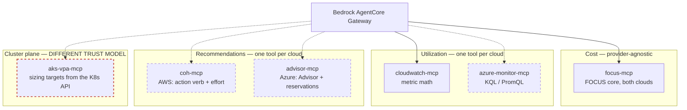

# Design 3 — Azure cost optimization and rightsizing advice

**Status: FEASIBILITY STUDY. Nothing adopted, nothing built.** Answers the question: if the
customer later wants rightsizing advice for Azure workloads the way we now do for AWS via
CloudWatch, how would we achieve it?

**Verdict: yes, and the pattern transfers cleanly — one tool per DATA CLASS, not one tool
per cloud.** Two genuinely new components are needed (Entra auth, and cluster-plane
access), and one thing turns out to be easier on Azure than on AWS.

Research date 2026-08-15, from Microsoft Learn and AWS primary sources. Confidence flags
are marked throughout; several items are composed inference and must be validated live.

---

## The central finding: the two clouds are strong in opposite places

| Question | AWS today | Azure |
|---|---|---|
| "How over-provisioned is this pod?" | ✅ CloudWatch metric math | ✅ KQL or PromQL |
| "What should I set the request to?" | ❌ **cannot answer** | ✅ **AKS VPA gives a target value** |
| "What is this pod's over-provisioning costing?" | ✅ **CUR split cost, per pod, in dollars** | ❌ **namespace only, portal only** |
| "Are there Kubernetes cost recommendations?" | ❌ Cost Optimization Hub returns **zero** | ✅ Advisor has a dedicated AKS section |

So a cross-cloud agent would answer *"which pods are oversized and what should they be"*
**better on Azure**, and *"what is it costing us"* **better on AWS**. That asymmetry is the
most useful thing in this document — it means multicloud parity is not achievable by
symmetry, and the persona must state different limitations per provider.

---

## Data class 1 — cost

Azure Cost Management FOCUS export, already covered by `design2.md`. No new work.

**Gap that matters:** FOCUS has **no Kubernetes columns at all**, on either provider. AWS
smuggles pod-level cost in through CUR 2.0 split cost allocation, which is *not* FOCUS. So
pod-level cost is inherently a provider-specific extension, not something the unified FOCUS
surface will ever carry.

## Data class 2 — utilization

| | AWS | Azure |
|---|---|---|
| Service | CloudWatch Container Insights | Azure Monitor **managed Prometheus** (current recommendation) or Container Insights / Log Analytics |
| Store | CloudWatch Metrics | Azure Monitor workspace, or Log Analytics workspace |
| Query | `GetMetricData` + metric math | PromQL, or KQL |
| API | `cloudwatch:GetMetricData` | `POST https://api.loganalytics.azure.com/v1/workspaces/{id}/query`, or `https://{ws}.{region}.prometheus.monitor.azure.com/api/v1/query_range` |

**Azure is more expressive here.** Requests and usage are both queryable and joinable in a
single statement, where CloudWatch needs metric math because no over-request metric exists.

Log Analytics — both counters live in `Perf` under `ObjectName == "K8SContainer"`:

| Signal | CounterName |
|---|---|
| CPU usage | `cpuUsageNanoCores` |
| CPU request | `cpuRequestNanoCores` |
| Memory working set | `memoryWorkingSetBytes` |
| Memory request | `memoryRequestBytes` |

Self-join on `InstanceName` (which encodes cluster / podUid / containerName), then join
`KubePodInventory` for pod and namespace names.

PromQL equivalent, if managed Prometheus is enabled:

```promql
(
  sum by (namespace, pod, container) (
    rate(container_cpu_usage_seconds_total{container!=""}[5m])
  )
  /
  sum by (namespace, pod, container) (
    kube_pod_container_resource_requests{resource="cpu"}
  )
) * 100
```

**Status note:** Microsoft describes Container Insights *metrics* collection as "replaced"
by managed Prometheus and labels the Log Analytics path "Classic". Logs collection remains
current. Microsoft does not use the phrase "maintenance mode" — that is community
shorthand. *[Documented / terminology unverified.]*

Limits worth knowing: Log Analytics query API caps at 500,000 records and ~100 MB raw per
query, 10 minutes with `Prefer: wait=600`, 200 requests per 30s per principal. Managed
Prometheus caps `query_range` at a 32-day window and requires a `__name__` matcher on every
query.

## Data class 3 — recommendations

No single Azure service mirrors Cost Optimization Hub. The role splits across two providers.

**Azure Advisor** — `GET https://management.azure.com/subscriptions/{id}/providers/Microsoft.Advisor/recommendations?api-version=2025-01-01&$filter=Category eq 'Cost'`

**Consumption / Cost Management** — reservation and savings-plan purchase recommendations,
`Microsoft.Consumption/reservationRecommendations` (api-version `2024-08-01`) and
`Microsoft.CostManagement/benefitRecommendations`.

Three rough edges compared with COH:

**No action-verb enum.** COH gives you `actionType` — Rightsize, Stop, Delete,
MigrateToGraviton. Advisor gives `category='Cost'` plus a `recommendationTypeId` GUID and
human-readable text. Mapping GUIDs to verbs is our work.

**Savings is not a typed field.** It lives in the untyped `extendedProperties` bag as
`savingsAmount` and `savingsCurrency` (monthly). The reservation API is better —
`netSavings`, `recommendedQuantity`, `skuName`, `term`, and an explicit `lookBackPeriod`.

**Subscription-scoped List only.** No management-group or tenant-level Advisor list
endpoint. Cross-subscription aggregation goes through Azure Resource Graph's
`advisorresources` table.

### Where Azure beats AWS: Advisor covers AKS

Unlike COH's zero Kubernetes coverage, Advisor has a dedicated AKS cost section
(`microsoft.containerservice/managedclusters`), including *"Enable Vertical Pod Autoscaler
recommendation mode to rightsize resource requests and limits"* (`22ae3910-…`), cluster
autoscaler profile tuning, and Spot node suggestions.

**Critical nuance:** Azure does not compute cost at pod level — AKS cost is node-based.
So the pod-rightsizing recommendation carries **no dollar figure**; the money is attached
to node-level recommendations. *[Documented.]*

## Data class 4 — the one AWS does not have: a sizing TARGET

**AKS has a GA Vertical Pod Autoscaler add-on.** `az aks update --enable-vpa`, Kubernetes
1.24+, and with `spec.updatePolicy.updateMode: "Off"` it computes recommendations and
**never touches a pod**.

```
status.recommendation.containerRecommendations[]:
  containerName
  target          {cpu, memory}   ← the value to set
  lowerBound      {cpu, memory}
  upperBound      {cpu, memory}
  uncappedTarget  {cpu, memory}
status.conditions[]: RecommendationProvided | LowConfidence | NoPodsMatched | FetchingHistory
```

This is exactly what the AWS persona is currently forced to decline: *"You may report a
percentile of observed usage but must not present it as a VPA recommendation."* On AKS the
recommendation genuinely exists, is machine-readable, and even carries a `LowConfidence`
condition the agent could surface honestly.

**But it is read from the Kubernetes API server, not ARM:**
`GET /apis/autoscaling.k8s.io/v1/namespaces/{ns}/verticalpodautoscalers/{name}` — see the
architectural warning below.

---

## Proposed topology



**The seam stays inside each tool.** The persona routes by *question type* — cost,
utilization, recommendation — not by cloud. Each tool hides its provider. That is the same
property that let `cloudwatch-mcp` land this week without touching the other two targets.

Recommendations are the one class where a *unified* tool would need real normalisation
(verb enum versus GUID), so two tools is the honest answer rather than a shared abstraction.

---

## The two genuinely new components

### 1. Entra authentication — solved, and better than expected

Every tool today uses the Lambda IAM execution role: no credentials to manage. Azure needs
an Entra token, which historically meant a stored service-principal secret.

**AWS IAM Outbound Identity Federation (launched 19 Nov 2025) removes the secret.** AWS
provisions a per-account OIDC issuer at `https://<uuid>.tokens.sts.global.api.aws` with
discovery and JWKS endpoints. The flow:

1. Lambda role gets `sts:GetWebIdentityToken`.
2. Lambda calls STS `GetWebIdentityToken` with `Audience=api://AzureADTokenExchange` and
   `SigningAlgorithm=RS256`. Returns a JWT with `iss` = the AWS issuer,
   `sub` = `arn:aws:iam::<acct>:role/<LambdaRole>`.
3. Entra app registration carries a **federated identity credential** ("Other issuer") with
   matching `issuer`, `subject`, and `audiences = api://AzureADTokenExchange`.
4. Lambda exchanges it at Entra's token endpoint with
   `client_assertion_type=urn:ietf:params:oauth:client-assertion-type:jwt-bearer`.

**No stored secret, nothing to rotate.** A flexible federated credential (preview) allows
claim-matching wildcards across roles, but is app-registration-only — not available on
user-assigned managed identities.

⚠️ *[COMPOSED INFERENCE.]* Each half is first-party documented and a Microsoft
TechCommunity post corroborates the AWS→Entra pattern, but no single Microsoft doc lists
AWS's issuer as pre-blessed. **Validate the exact `iss`/`sub`/`aud` claims against a live
token in a test tenant before committing.** Fallback is a client secret in Secrets Manager
with rotation.

RBAC for read-only, at subscription or management-group scope:

| Target | Built-in role |
|---|---|
| Cost Management | `Cost Management Reader` |
| Azure Monitor metrics | `Monitoring Reader` |
| Log Analytics query | `Log Analytics Reader` |
| Azure Advisor | `Reader` — Advisor has no dedicated role |

Enterprise caveat: many tenants block secret credentials or apply conditional access to
service principals. Federation is the friendlier path politically as well as operationally.

### 2. Cluster-plane access — the real architectural novelty

**Every tool we have talks to a cloud-provider control plane. Reading VPA would be the
first that needs credentials *inside a cluster*.**

That is a materially different security conversation: a kubeconfig or service-account
token, RBAC inside the cluster, and for a private AKS cluster a network path as well. In an
enterprise like this customer, that is the item most likely to stall — not the code.

Two ways to avoid it, both worth considering before proposing cluster access:

- **Take the Advisor recommendation instead of the VPA object.** Advisor will tell you a
  cluster should enable VPA recommendation mode. Less precise, no per-container target,
  but pure ARM read.
- **Have the customer export VPA recommendations outward** — a scheduled job in their
  cluster writing recommendations to storage the agent already reads. Keeps the cluster
  boundary intact and follows the `design2.md` ownership principle: the customer produces,
  we read.

---

## What is NOT achievable on Azure

**Per-pod cost in dollars.** AKS cost analysis (OpenCost-based, GA, free) reaches
**namespace**, not pod — and it is a **portal-only Cost analysis view**. There is no
documented path for namespace attribution to reach Cost Management exports, standard or
FOCUS. Azure's nearest analogue to "requested but unused" is the `Idle charges` dimension,
reported at cluster/namespace level as idle *capacity*, not a per-pod requested-minus-used
delta.

*[Strong inference — the docs describe it exclusively as a portal experience and no export
schema lists a Kubernetes column, but there is no explicit "not exported" statement.]*

Consequence: the `$28.36 used / $111.99 unused` per-pod framing has **no managed Azure
equivalent**. Reaching parity would mean self-hosting OpenCost or Kubecost — which is
customer-side infrastructure, not a tool we add.

Prerequisites for AKS cost analysis, if the customer wants even namespace level: Standard
or Premium tier (not Free), **Enterprise Agreement or Microsoft Customer Agreement only**,
managed identity, Disk CSI driver, ~7,000 container ceiling, no virtual nodes, 8–24h before
data appears.

---

## Honest summary for a customer conversation

Azure rightsizing is achievable and in one respect better: it can tell you *what to set*,
which the AWS side cannot. It is worse at *what it costs* below namespace level. The work
is three new tools plus one authentication mechanism — additive, not a redesign, because
the persona routes on question type and each tool hides its cloud.

The thing to raise early is not effort but **access**: reading sizing targets means
reaching into a cluster, and that decision belongs to their platform and security teams
long before it belongs to us.

## Verification status

| Claim | Status |
|---|---|
| Perf counter names, KQL join, PromQL | ✅ Verified against Microsoft sample queries |
| Log Analytics + Prometheus API endpoints and limits | ✅ Verified |
| AKS VPA GA, `updateMode: Off`, CRD recommendation fields | ✅ Verified |
| Advisor API paths, `extendedProperties.savingsAmount`, AKS rec IDs | ✅ Verified |
| Advisor has no action-verb enum, subscription-scoped List only | ✅ Verified |
| AKS cost analysis reaches namespace only | ✅ Verified |
| AKS namespace cost absent from exports / FOCUS | ⚠️ Strong inference from documentary silence |
| AWS Outbound Identity Federation → Entra FIC end-to-end | ⚠️ Composed from two documented halves — **test live** |
| `benefitRecommendations` field schema | ❌ Not fetched |
| ARM throttling numbers | ❌ Not fetched |
