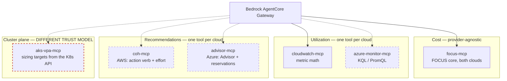

# Design 3 — Azure cost optimization and rightsizing advice

**Status: FEASIBILITY STUDY. Nothing adopted, nothing built.** Answers the question: if the
customer later wants rightsizing advice for Azure workloads the way we now do for AWS via
CloudWatch, how would we achieve it?

**Verdict: yes, and the pattern transfers cleanly — one tool per DATA CLASS, not one tool
per cloud.** Two genuinely new components are needed (Entra auth, and cluster-plane
access), and one thing turns out to be easier on Azure than on AWS.

Research date 2026-08-15, from Microsoft Learn and AWS primary sources. Confidence flags
are marked throughout; several items are composed inference and must be validated live.

---

## The central finding: the two clouds are strong in opposite places

| Question | AWS today | Azure |
|---|---|---|
| "How over-provisioned is this pod?" | ✅ CloudWatch metric math | ✅ KQL or PromQL |
| "What should I set the request to?" | ❌ **cannot answer** | ✅ **AKS VPA gives a target value** |
| "What is this pod's over-provisioning costing?" | ✅ **CUR split cost, per pod, in dollars** | ❌ **namespace only, portal only** |
| "Are there Kubernetes cost recommendations?" | ❌ Cost Optimization Hub returns **zero** | ✅ Advisor has a dedicated AKS section |

So a cross-cloud agent would answer *"which pods are oversized and what should they be"*
**better on Azure**, and *"what is it costing us"* **better on AWS**. That asymmetry is the
most useful thing in this document — it means multicloud parity is not achievable by
symmetry, and the persona must state different limitations per provider.

---

## Data class 1 — cost

Azure Cost Management FOCUS export, already covered by `design2.md`. No new work.

**Gap that matters:** FOCUS has **no Kubernetes columns at all**, on either provider. AWS
smuggles pod-level cost in through CUR 2.0 split cost allocation, which is *not* FOCUS. So
pod-level cost is inherently a provider-specific extension, not something the unified FOCUS
surface will ever carry.

## Data class 2 — utilization

| | AWS | Azure |
|---|---|---|
| Service | CloudWatch Container Insights | Azure Monitor **managed Prometheus** (current recommendation) or Container Insights / Log Analytics |
| Store | CloudWatch Metrics | Azure Monitor workspace, or Log Analytics workspace |
| Query | `GetMetricData` + metric math | PromQL, or KQL |
| API | `cloudwatch:GetMetricData` | `POST https://api.loganalytics.azure.com/v1/workspaces/{id}/query`, or `https://{ws}.{region}.prometheus.monitor.azure.com/api/v1/query_range` |

**Azure is more expressive here.** Requests and usage are both queryable and joinable in a
single statement, where CloudWatch needs metric math because no over-request metric exists.

Log Analytics — both counters live in `Perf` under `ObjectName == "K8SContainer"`:

| Signal | CounterName |
|---|---|
| CPU usage | `cpuUsageNanoCores` |
| CPU request | `cpuRequestNanoCores` |
| Memory working set | `memoryWorkingSetBytes` |
| Memory request | `memoryRequestBytes` |

Self-join on `InstanceName` (which encodes cluster / podUid / containerName), then join
`KubePodInventory` for pod and namespace names.

PromQL equivalent, if managed Prometheus is enabled:

```promql
(
  sum by (namespace, pod, container) (
    rate(container_cpu_usage_seconds_total{container!=""}[5m])
  )
  /
  sum by (namespace, pod, container) (
    kube_pod_container_resource_requests{resource="cpu"}
  )
) * 100
```

**Status note:** Microsoft describes Container Insights *metrics* collection as "replaced"
by managed Prometheus and labels the Log Analytics path "Classic". Logs collection remains
current. Microsoft does not use the phrase "maintenance mode" — that is community
shorthand. *[Documented / terminology unverified.]*

Limits worth knowing: Log Analytics query API caps at 500,000 records and ~100 MB raw per
query, 10 minutes with `Prefer: wait=600`, 200 requests per 30s per principal. Managed
Prometheus caps `query_range` at a 32-day window and requires a `__name__` matcher on every
query.

## Data class 3 — recommendations

No single Azure service mirrors Cost Optimization Hub. The role splits across two providers.

**Azure Advisor** — `GET https://management.azure.com/subscriptions/{id}/providers/Microsoft.Advisor/recommendations?api-version=2025-01-01&$filter=Category eq 'Cost'`

**Consumption / Cost Management** — reservation and savings-plan purchase recommendations,
`Microsoft.Consumption/reservationRecommendations` (api-version `2024-08-01`) and
`Microsoft.CostManagement/benefitRecommendations`.

Three rough edges compared with COH:

**No action-verb enum.** COH gives you `actionType` — Rightsize, Stop, Delete,
MigrateToGraviton. Advisor gives `category='Cost'` plus a `recommendationTypeId` GUID and
human-readable text. Mapping GUIDs to verbs is our work.

**Savings is not a typed field.** It lives in the untyped `extendedProperties` bag as
`savingsAmount` and `savingsCurrency` (monthly). The reservation API is better —
`netSavings`, `recommendedQuantity`, `skuName`, `term`, and an explicit `lookBackPeriod`.

**Subscription-scoped List only.** No management-group or tenant-level Advisor list
endpoint. Cross-subscription aggregation goes through Azure Resource Graph's
`advisorresources` table.

### Where Azure beats AWS: Advisor covers AKS

Unlike COH's zero Kubernetes coverage, Advisor has a dedicated AKS cost section
(`microsoft.containerservice/managedclusters`), including *"Enable Vertical Pod Autoscaler
recommendation mode to rightsize resource requests and limits"* (`22ae3910-…`), cluster
autoscaler profile tuning, and Spot node suggestions.

**Critical nuance:** Azure does not compute cost at pod level — AKS cost is node-based.
So the pod-rightsizing recommendation carries **no dollar figure**; the money is attached
to node-level recommendations. *[Documented.]*

## Data class 4 — the one AWS does not have: a sizing TARGET

**AKS has a GA Vertical Pod Autoscaler add-on.** `az aks update --enable-vpa`, Kubernetes
1.24+, and with `spec.updatePolicy.updateMode: "Off"` it computes recommendations and
**never touches a pod**.

```
status.recommendation.containerRecommendations[]:
  containerName
  target          {cpu, memory}   ← the value to set
  lowerBound      {cpu, memory}
  upperBound      {cpu, memory}
  uncappedTarget  {cpu, memory}
status.conditions[]: RecommendationProvided | LowConfidence | NoPodsMatched | FetchingHistory
```

This is exactly what the AWS persona is currently forced to decline: *"You may report a
percentile of observed usage but must not present it as a VPA recommendation."* On AKS the
recommendation genuinely exists, is machine-readable, and even carries a `LowConfidence`
condition the agent could surface honestly.

**But it is read from the Kubernetes API server, not ARM:**
`GET /apis/autoscaling.k8s.io/v1/namespaces/{ns}/verticalpodautoscalers/{name}` — see the
architectural warning below.

---

## Proposed topology



**The seam stays inside each tool.** The persona routes by *question type* — cost,
utilization, recommendation — not by cloud. Each tool hides its provider. That is the same
property that let `cloudwatch-mcp` land this week without touching the other two targets.

Recommendations are the one class where a *unified* tool would need real normalisation
(verb enum versus GUID), so two tools is the honest answer rather than a shared abstraction.

---

## The two genuinely new components

### 1. Entra authentication — documented, not a workaround

Every tool today uses the Lambda IAM execution role: no credentials to manage. Azure needs
an Entra token, which historically meant a stored service-principal secret.

**That is no longer true, and Microsoft documents the AWS case explicitly.** The Entra
workload-identity-federation concepts page (updated 2025-04-09) lists AWS as a supported
scenario verbatim: *"Workloads running in Amazon Web Services (AWS). First, configure a
trust relationship between your user-assigned managed identity or app in Microsoft Entra ID
and your AWS account using IAM Outbound Identity Federation."* `[DOCUMENTED]`
<https://learn.microsoft.com/en-us/entra/workload-id/workload-identity-federation>

The flow:

1. Enable once per AWS account — `EnableOutboundWebIdentityFederation` returns an
   account-specific `IssuerUrl` hosting `/.well-known/openid-configuration` and
   `/.well-known/jwks.json`.
2. Lambda execution role gets `sts:GetWebIdentityToken`. At runtime the Lambda calls it with
   `Audience=api://AzureADTokenExchange`, `SigningAlgorithm` of `RS256` **or** `ES384`, and
   `DurationSeconds` between 60 and 3600.
3. The returned JWT carries `sub` = the IAM principal ARN, plus extra claims including
   `org_id`, `principal_tags` and **`lambda_source_function_arn`** — that last one means the
   trust can be scoped to an individual function, not merely a role.
4. Entra app registration carries a **federated identity credential** created via Graph v1.0
   `POST /applications/{objectId}/federatedIdentityCredentials` with `issuer`, `subject`,
   and `audiences: ["api://AzureADTokenExchange"]`.
5. Lambda exchanges it at `POST https://login.microsoftonline.com/{tenant}/oauth2/v2.0/token`
   with `client_assertion_type=urn:ietf:params:oauth:client-assertion-type:jwt-bearer` and
   `grant_type=client_credentials`.

**No stored secret, nothing to rotate.** AWS manages the issuer and its JWKS.

Operational details that will bite if missed:

- **`GetWebIdentityToken` is not available on the STS global endpoint** — use a regional one.
- **`iss`, `sub` and `aud` must match the credential case-sensitively.** Max 20 federated
  credentials per app, `issuer`/`subject` capped at 600 chars, and Entra stores only the
  first 100 signing keys from the issuer.
- **You need at least two access tokens.** Client credentials issues one resource per token,
  and the targets have different audiences: `https://management.azure.com/.default` covers
  Cost Management, Monitor metrics and Advisor, but the Log Analytics query API needs
  `https://api.loganalytics.io/.default`.
- These AWS-issued JWTs cannot be used for inbound OIDC back into AWS.
- A preview "flexible" federated credential allows a `claimsMatchingExpression` instead of a
  fixed subject, but is app-registration-only — not available on user-assigned managed
  identities.

RBAC for read-only, assigned to the app's service principal:

| Target | Built-in role | Scope |
|---|---|---|
| Cost Management | `Cost Management Reader` (`72fafb9e-0641-4937-9268-a91bfd8191a3`) | Subscription or management group |
| Log Analytics query | `Log Analytics Data Reader` (`3b03c2da-16b3-4a49-8834-0f8130efdd3b`) | **Workspace** — tightest fit |
| Azure Monitor metrics | `Monitoring Reader` (`43d0d8ad-25c7-4714-9337-8ba259a9fe05`) | Subscription |
| Azure Advisor | **already covered** — `Cost Management Reader` includes `Microsoft.Advisor/recommendations/read` | — |

Advisor needs no separate role: `Cost Management Reader` grants Advisor recommendation reads
explicitly. There is no dedicated Advisor read-only role; "Advisor Reviews Reader" is
resiliency-scoped and does not cover general recommendations.

⚠️ **One unresolved permission question.** The Cost Management **Query** API is invoked as
`Microsoft.CostManagement/query/action`, but `Cost Management Reader` grants
`Microsoft.CostManagement/*/read`. On a strict reading those do not match. In practice the
Reader role is widely reported to run queries and Microsoft describes it as "view cost data
and configuration". **Verify with a live role assignment and a test query**; documented
fallback is `Cost Management Contributor`.

⚠️ **Two enterprise tenant policies commonly decide this for you.** A tenant app-management
policy blocking custom passwords makes the client-secret path impossible outright — which is
an argument *for* federation rather than against it. Separately, Conditional Access for
workload identities can gate service-principal sign-in by named location, so AWS egress
ranges may need allowlisting.

### 2. Cluster-plane access — the real architectural novelty

**Every tool we have talks to a cloud-provider control plane. Reading VPA would be the
first that needs credentials *inside a cluster*.**

That is a materially different security conversation: a kubeconfig or service-account
token, RBAC inside the cluster, and for a private AKS cluster a network path as well. In an
enterprise like this customer, that is the item most likely to stall — not the code.

Two ways to avoid it, both worth considering before proposing cluster access:

- **Take the Advisor recommendation instead of the VPA object.** Advisor will tell you a
  cluster should enable VPA recommendation mode. Less precise, no per-container target,
  but pure ARM read.
- **Have the customer export VPA recommendations outward** — a scheduled job in their
  cluster writing recommendations to storage the agent already reads. Keeps the cluster
  boundary intact and follows the `design2.md` ownership principle: the customer produces,
  we read.

---

## What is NOT achievable on Azure

**Per-pod cost in dollars.** AKS cost analysis (OpenCost-based, GA, free) reaches
**cluster, namespace and workload** level — Microsoft states it *"focuses primarily on
cluster, namespace, and workload-level costs, rather than individual pod-level costs"* — and
it is a **portal-only Cost analysis view**. There is no documented path for that attribution
to reach Cost Management exports, standard or FOCUS. Azure's nearest analogue to "requested
but unused" is the `Idle charges` dimension ("the cost of available resource capacity that
isn't used by any workloads"), with `Unallocated charges` for what could not be mapped to a
namespace — both currency-denominated, both cluster/namespace level, and both portal
concepts rather than export columns.

The full Microsoft FOCUS schema was read across 1.0, 1.0r2, 1.2-preview and 1.0-preview:
**no column, standard or `x_`-prefixed, references a Kubernetes namespace, pod, controller
or workload.** `x_CostAllocationRuleName` exists but refers to manual Cost Management
allocation rules, unrelated to the AKS add-on. An AKS cluster appears in exports only as its
underlying Azure resources — nodes, disks, load balancers.

*[Granularity, idle definitions and the FOCUS schema absence are all verified. The one
inference is that namespace attribution is excluded from exports: the docs describe it
exclusively as a portal experience and no export schema lists a Kubernetes column, but there
is no explicit "not exported" sentence.]*

Consequence: the `$28.36 used / $111.99 unused` per-pod framing has **no managed Azure
equivalent**. Reaching parity would mean self-hosting OpenCost or Kubecost — which is
customer-side infrastructure, not a tool we add.

Prerequisites for AKS cost analysis, if the customer wants even namespace level: Standard
or Premium tier (not Free), **Enterprise Agreement or Microsoft Customer Agreement only**,
managed identity, Disk CSI driver, ~7,000 container ceiling, no virtual nodes, 8–24h before
data appears.

---

## Honest summary for a customer conversation

Azure rightsizing is achievable and in one respect better: it can tell you *what to set*,
which the AWS side cannot. It is worse at *what it costs* below namespace level. The work
is three new tools plus one authentication mechanism — additive, not a redesign, because
the persona routes on question type and each tool hides its cloud.

The thing to raise early is not effort but **access**: reading sizing targets means
reaching into a cluster, and that decision belongs to their platform and security teams
long before it belongs to us. Authentication, by contrast, is a solved problem — Microsoft
documents the AWS federation path and it needs no stored secret.

## Verification status

| Claim | Status |
|---|---|
| Perf counter names, KQL join, PromQL | ✅ Verified against Microsoft sample queries |
| Log Analytics + Prometheus API endpoints and limits | ✅ Verified |
| AKS VPA GA, `updateMode: Off`, CRD recommendation fields | ✅ Verified |
| Advisor API paths, `extendedProperties.savingsAmount`, AKS rec IDs | ✅ Verified |
| Advisor has no action-verb enum, subscription-scoped List only | ✅ Verified |
| AKS cost analysis reaches cluster/namespace/workload, not pod | ✅ Verified — quoted from Microsoft |
| `Idle charges` / `Unallocated charges` definitions | ✅ Verified |
| FOCUS schema has no Kubernetes columns (1.0, 1.0r2, 1.2-preview) | ✅ Verified — full schema read |
| AKS namespace cost absent from exports | ⚠️ Strong inference from documentary silence |
| **AWS → Entra federation supported** | ✅ **Verified — Microsoft lists AWS explicitly (page updated 2025-04-09)** |
| `GetWebIdentityToken` params, JWT claims, FIC fields and limits | ✅ Verified |
| Two-token audience split (ARM vs Log Analytics) | ✅ Verified from documented audience rules |
| RBAC role names and GUIDs | ✅ Verified |
| Cost Management Reader covers the Query `/action` | ⚠️ Action-string mismatch — **test live**, fallback Cost Management Contributor |
| Tenant policies blocking secrets / CA on workload identities | ✅ Verified |
| `benefitRecommendations` field schema | ❌ Not fetched |
| ARM throttling numbers | ❌ Not fetched |
