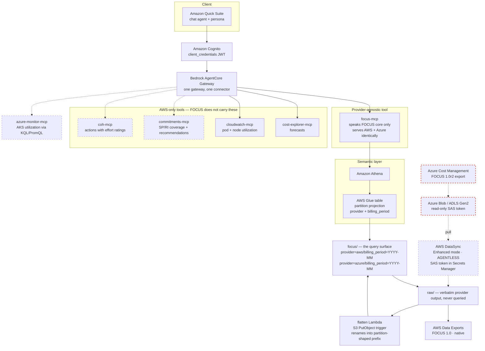

# Architecture — multicloud FinOps agent, target state

Companion to the current-state diagram in `design.md`. This one shows where the solution is
going: **one semantic layer over FOCUS in S3, both clouds, queried by provider-agnostic
tools.**

Reading key:

- **Solid** — live today, verified in production
- **Dashed** — Phase 2, the Azure path
- **Dashed + red** — customer-owned. Their deliverable, not ours.

---

## The seam is the FOCUS table

Everything **above** `focus/` is provider-agnostic. Everything **below** it is
provider-specific. That single boundary is what makes Azure additive instead of a rewrite:

- `focus-mcp` speaks FOCUS core and nothing else. It never learns that Azure exists — a
  second provider is a new partition value, not a new tool, not a new persona rule.
- Adding a provider means landing files in `raw/` and teaching the flatten step one new
  path shape. Nothing downstream changes.
- The tool is named for the **schema it speaks**, not the engine it runs on. Athena is an
  implementation detail; FOCUS is the contract.

## What FOCUS does *not* unify — and why four tools stay AWS-only

This is the honest part of the diagram, and worth saying out loud to a customer who assumes
one standard solves everything.

FOCUS is a **billing** schema. It carries cost, service, region, account, tags and
commitment-discount columns. It does **not** carry:

| Need | Why FOCUS can't serve it | Stays provider-specific |
|---|---|---|
| Forecasts | not a billing record | `cost-explorer-mcp` |
| SP/RI coverage & purchase recommendations | optimizer output, not billing | `commitments-mcp` |
| Utilization (CPU/memory) | telemetry, not billing | `cloudwatch-mcp`, `azure-monitor-mcp` |
| Machine-generated actions with effort ratings | recommendation engine output | `coh-mcp` |
| **Kubernetes pod attribution** | **no Kubernetes columns in any FOCUS version** | AWS: CUR split cost allocation |

That last row matters most. The FOCUS schema was read across versions 1.0, 1.0r2 and
1.2-preview: **no column, standard or `x_`-prefixed, references a namespace, pod, controller
or workload.** AWS smuggles pod-level cost in through CUR 2.0 split cost allocation, which is
*not* FOCUS. Azure's nearest equivalent reaches namespace level and is portal-only.

So the honest statement: **FOCUS unifies the cost question. It does not unify the
optimization question.** Per-cloud tools are not a design failure — they're what the standard
leaves out.

## The Azure ingestion path

**Agentless.** DataSync transfers between Azure Blob and Amazon S3 in **Enhanced mode require
no agent** — no VM in the customer's Azure tenant, no Hyper-V image, no activation key. The
task runs in our account and pulls.

**Which reduces the customer ask to one sentence:** *produce a FOCUS 1.0r2 export, and give us
a read-only SAS token on that container.* No copy job for them to own, no compute in their
tenant.

**Four things to get right:**

1. **SAS token** needs `Read` + `List`. Store it in **Secrets Manager**, not inline. Expiry is
   the operational weak point — if it lapses mid-transfer the task fails with
   `Failed to open directory` and needs the location updated and the task restarted. Plan
   rotation.
2. 🚩 **Turn OFF object-tag copying.** DataSync copies tags by default, and *"your task will
   fail if you try to copy object tags and your storage account uses a hierarchical
   namespace."* Azure cost exports commonly land in **ADLS Gen2**, which is HNS. Check this
   first.
3. **Access tiers** — hot and cool transfer fine; archive must be rehydrated first; the cold
   tier is unsupported.
4. **Scope with `--subdirectory`** to the export path. Note a folder-scoped SAS is not
   supported, nor is a user-delegation SAS — the token must be account or container level.

**DataSync solves transport, not layout.** Azure writes
`focus-1-0r2/<date-range>/<RunID>/part_*.parquet` — a date range and a GUID. Partition
projection cannot address that, so DataSync faithfully lands unqueryable structure. Hence the
**flatten Lambda**: an S3 `PutObject` trigger that copies each object into
`focus/provider=azure/billing_period=YYYY-MM/`. Roughly thirty lines, event-driven, no
schedule to operate — and it is the *only* custom code in the Azure path.

## Why S3 + Athena rather than a database

Considered and rejected: loading FOCUS CSV into RDS/Aurora Postgres.

Measured on the live account — `cur2` is 114 columns and 393,965 rows for one month, which
Parquet+Snappy compresses to **7.2 MB** (~19 bytes/row, because billing data is highly
repetitive). All eleven months are 48 MB.

| | Athena over S3 | Aurora Serverless v2 |
|---|---|---|
| Idle cost | **zero** | ~$44/month minimum just to exist |
| Storage | ~$0.001/month | ~$1/month for the same data as rows + indexes |
| 1,000 queries | ~$0.05 | $0 marginal |

FinOps queries are `SUM(cost) GROUP BY dimension` over three or four columns of a very wide
table — the canonical columnar workload. A row store reads whole rows. And a database
reintroduces a load pipeline, drags the Lambdas into a VPC, and breaks the
"customer produces, we read" property.

**Where Postgres would earn its place:** as a *serving layer* of pre-aggregated rollups
(thousands of rows per month, not millions) if CelcomDigi's own team wants to point Power BI
or Grafana at a SQL endpoint. That is a question worth asking them — it changes the
architecture, and it is additive rather than a replacement.

## Phasing

**Live today** — AWS cost via CUR 2.0, pod-level cost via split cost allocation, pod and node
utilization via Container Insights, cluster cost attribution. 16 tools, three gateway targets.

**Phase 2, no Azure dependency** — `commitments-mcp` (SP/RI, 8 Cost Explorer operations) and
`coh-mcp`. Both are AWS-only and unblocked; they close the two largest gaps in the current
answer set.

**Phase 2, Azure** — blocked on the customer producing a FOCUS 1.0r2 export and a SAS token.
Then: DataSync task, flatten Lambda, one new partition value, extend the Glue table.
`focus-mcp` replaces `athena-mcp` at this point, because the tool should speak the schema.

**Phase 3** — `azure-monitor-mcp` for AKS utilization. Note the asymmetry: AKS has a GA
Vertical Pod Autoscaler that returns an actual target value, which AWS has no equivalent for;
but Azure has no per-pod cost, which AWS does. The two clouds are strong in opposite places,
so the persona must state different limitations per provider.

## Open risks, carried from `design.md`

- **Parquet numeric types** across providers — decimal versus double fails at read time, not
  DDL time. Unresolvable without a real Azure export.
- **Column intersection** is guesswork until real Azure output exists. The curated table must
  hold the intersection, with provider extras pushed into an `x_payload` JSON column.
- **`Tags` will not union as-is** — AWS types it `Map`, Azure documents a JSON object which is
  a string in practice. Both must normalise to a JSON string.
- **FOCUS partition casing**: the AWS FOCUS export uses lowercase `billing_period=`, while
  CUR 2.0 uses uppercase `BILLING_PERIOD=`. Same service, same account. Getting this wrong
  returns zero rows silently.
