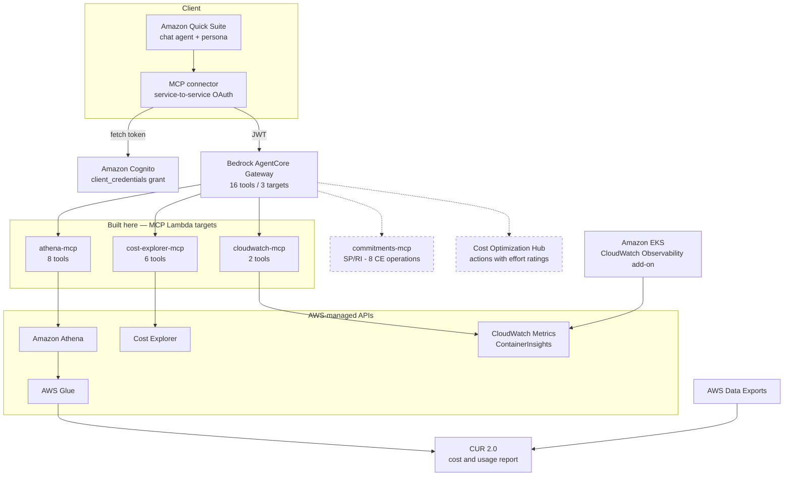

# TAM demo brief — CelcomDigi FinOps agent
**Thursday 20 August 2026** · everything below verified live **18 Aug 2026, 09:45 +08**

Gateway healthy: `athena-mcp` 8 · `cloudwatch-mcp` 2 · `cost-explorer-mcp` 6 = **16 tools, all READY**.

⚠️ **August figures accrue daily, and the demo is two days out.** The pod numbers in
`demo-script-2026-08-20.md` are already stale (`$28.36/$111.99` on 15 Aug →
`$39.90/$157.71` on 18 Aug) and will move again by Thursday. **Quote the RATIO, not the
dollars**: ~80% of pod-attributed spend is requested-but-unused. That ratio has held for
four days. Same for the monthly total — August has gone `$1,744` → `$2,083` → `$2,796`.

---

# 1. Soon Wah's email — the answer

He asked three levels. **Two are fully answerable, one is partial.** Lead with this table.

| His ask | Answer | Evidence |
|---|---|---|
| **Pod — CPU/mem requests vs actual usage** | ✅ **Yes, both in dollars and in percent** | ~80% of pod spend unused; `demo-web` at **0.06%** of CPU request |
| **Pod — identify over-provisioned pods** | ✅ **Yes, per pod, per namespace** | 5 × `metrics-server` each ~19× over-requested |
| **Pod — adjust requests/limits** | ⚠️ **Evidence yes, target value no** | We give measured usage; VPA gives the number to set |
| **Pod — VPA / Datadog** | ❌ **Not available** | No VPA recommendation API on AWS |
| **Node — utilization** | ✅ Yes | CloudWatch `node_cpu_*` / `node_memory_*` |
| **Node — cost per node** | ✅ Yes | pods roll up via `split_line_item_parent_resource_id` |
| **Node — reduce count / instance type / bin-packing** | ❌ **No** | data supports the judgement; agent does not make it |
| **Cluster — idle clusters** | ✅ **Yes, found unprompted** | 3 clusters × **$446.40/mo** control plane; one named `test-old-cluster` |
| **Cluster — overall efficiency & cost** | ✅ Yes | full cost attribution per cluster |

## What to say, level by level

**Cluster level — open here, it's your strongest card.**

> "The agent found this without being asked. Three clusters each paying the full $446.40
> monthly control-plane charge. One is called `test-old-cluster`, another `eks-workshop`.
> That's roughly **$893 a month** for two clusters that look non-production."

Then immediately qualify it — this sentence matters more than the finding:

> "The cost is measured. 'Non-production' is inferred from a name. The agent says so
> explicitly, and tells you what evidence would confirm it."

**Pod level — his highest priority. Answer it in two halves.**

> "First, what it costs. EKS split cost allocation in the billing data expresses
> requests-versus-usage directly in dollars, per pod, with cluster and namespace.
> Right now about **80% of pod-attributed spend** is capacity that was requested and never
> touched. The worst offenders are five `metrics-server` replicas, each requesting roughly
> **19 times** what it uses — that's the default manifest, not a decision anyone made.
>
> Second, how far off the request is. The agent reads CloudWatch Container Insights and
> computes usage as a percentage of request. `demo-web` is running at **0.06%** of its
> requested CPU."

Then the honest boundary:

> "What it will not do is hand you a number to set. It tells you a pod uses 0.06% of its
> request and shows the distribution — the decision to set `250m` instead of `500m` stays
> with VPA, Datadog, or a human. The agent supplies the evidence for that decision."

**Node level — cost yes, bin-packing no.**

> "Pod costs roll up to the node they ran on, and node CPU and memory utilization come from
> the same Container Insights data. What it won't produce is a bin-packing plan or an
> instance-type recommendation for EKS nodes. That's a judgement the data supports rather
> than one the agent makes."

## The two limits to state before he finds them

**No VPA recommendations.** Say it plainly. It's the one thing on his list that AWS has no
API for, and pretending otherwise fails the moment he checks.

**Only one cluster is instrumented.** Container Insights runs on `demo-cluster` only; the
other five return nothing.

> "The agent reports that a cluster isn't instrumented rather than inferring anything. Zero
> datapoints and zero usage look identical to a naive tool — this one knows the difference."

**That limit is the pitch.** It sets up the framing:

> **The agent's ceiling is the data it can read.** Cost data was connected first, which is
> why it could already talk about spend. Container Insights was added last week, which is
> what made utilization answerable. If your utilization data lives in Datadog rather than
> CloudWatch, that's another connector — not a different product.

Which turns Thursday from a feature demo into: **which sources do we connect for
CelcomDigi?**

---

# 2. Demo questions — expected values as of today

Full script: `/Users/kahhaw/projects/celcomdigi/sample-finops-agent/docs/demo-script-2026-08-20.md`

**Q1 — "What did we spend each month since October 2025?"** → 11 rows.

```
2025-10  1,789.58     2026-02  2,596.95     2026-06  3,502.50
2025-11  1,991.06     2026-03  3,187.69     2026-07  4,182.48
2025-12  2,043.07     2026-04  3,466.60     2026-08  accruing - do not quote
2026-01  2,247.62     2026-05  3,700.47
```
Say: every figure reconciles to Cost Explorer to the cent.

**Q2 — "Why did costs increase from June to July?"** → +19.4% (`+$679.98`), **87% from three
services**: Bedrock `+$258.95`, EKS `+$217.41`, EC2 `+$111.94`, plus `DevOpsAgent` appearing
at `$54.42`. Say: a chart shows the line rising; this attributes most of it and names a new
service.

**Q3 — "Split Bedrock spend in July into input, output and cache tokens."** → input `$5.89`,
output `$95.51`, **cache `$321.91`**. Cache is 76% of Bedrock spend, 55× input. Cost Explorer
cannot bucket-and-sum like this.

**Q4 — "Which individual resources cost the most in July 2026?"** → QuickSight app ≈`$792.50`,
then **three EKS clusters at exactly `$446.40`**, then Bedrock, then RDS. Use the qualifier
sentence above.

**Q5 — "Which pods are over-provisioned, and what is it costing us?"** → **~80% unused**.
Current MTD: `$39.90` used / `$157.71` unused. Top rows:

| Pod | Used | Unused |
|---|---|---|
| `amazon-cloudwatch/cloudwatch-agent-fvxp4` | 3.04 | **13.68** |
| `kube-system/metrics-server` × 5 replicas | ~0.46 each | ~8.6 each |

Agent must state the **one-month limitation** — this table holds August 2026 only.

**Q6 — "What percentage of its CPU request does demo-web actually use?"** → **0.0603%**
(24 hourly points, max 0.0625%). `demo-api` is 0.0592%. Roughly 1,700× over-provisioned.
Pair it with Q5 out loud: CUR gives the dollar impact, CloudWatch gives the corrective signal.

**Q7 — "How over-provisioned is platform-prod?"** → **must say NOT INSTRUMENTED.**
🚨 If it returns a confident number, stop asking utilization questions — the coverage rule
didn't apply.

**Q8 — "What is our Savings Plans coverage?"** → **must decline.** Then move to §3.

---

# 3. SP/RI — what is lacking in your setup

**Verified on this account: 0 Savings Plans, 0 EC2 RIs, 0 RDS RIs.** Cost Explorer's purchase
recommendation returns null. Nothing to demo — which is honest, and keeps the conversation on
their estate.

## The gap splits in two, and only one half needs new plumbing

**Analysis — you already have the data.** CUR 2.0 carries `savings_plan_*` and
`reservation_*` columns. Coverage, utilization, waste and expiry are all computable today
with SQL through `athena-mcp`, sliced per account, per service, per instance family.
**No new tool required.** The reason the agent declines Q8 is a persona rule, not a data gap.

**Recommendation — not derivable.** "What should we buy, at what term, what hourly
commitment" comes from AWS's own optimizer over a lookback window. You cannot compute it from
CUR, and an agent that tries is inventing a commercial recommendation.

## What's missing: 8 Cost Explorer operations

| Purpose | Operation |
|---|---|
| SP coverage | `GetSavingsPlansCoverage` |
| SP utilization | `GetSavingsPlansUtilization` |
| SP utilization detail | `GetSavingsPlansUtilizationDetails` |
| RI coverage | `GetReservationCoverage` |
| RI utilization | `GetReservationUtilization` |
| RI purchase rec | `GetReservationPurchaseRecommendation` |
| SP purchase rec | `GetSavingsPlansPurchaseRecommendation` |
| SP rec generation | `StartSavingsPlansPurchaseRecommendationGeneration` |

Plus `savingsplans:DescribeSavingsPlans` — a different service namespace — for inventory:
what do we own, when does it expire.

That's a fourth Lambda target on the same gateway, same pattern as the CloudWatch tool added
last week. IAM is `ce:Get*` plus `savingsplans:Describe*`, **read-only, no write path** — a
commitment is a one-to-three-year contract; the agent recommends, a human signs.

## Four things to say if he pushes — they show you've thought past the demo

1. **Purchase recommendations are asynchronous.** You call
   `StartSavingsPlansPurchaseRecommendationGeneration`, then retrieve. Start-poll-get.
2. **Commitments are shared across the organisation**, so coverage must be computed at
   **payer scope**. `AccountScope` is a real API parameter, and getting it wrong produces
   confident nonsense in a multi-account estate. Theirs is multi-account.
3. **A recommendation is a point-in-time optimizer output, not a fact.** Lookback is 7, 30 or
   60 days; a 7-day window over an atypical week misleads. Whatever we build states its
   lookback.
4. **Cost Explorer bills per API request**, unlike Athena where you pay per byte scanned. An
   agent that loops over dimensions can generate real spend from one question.

## The strongest argument — and you cannot demo it

> "On an estate with real Savings Plans, `UnblendedCost` and `NetAmortizedCost` can differ by
> 30% or more. On this demo account they are byte-identical, because there's nothing to
> amortise — so an agent that silently picks the wrong metric **cannot be caught here**. On
> yours it would be a wrong-answer generator. That's why the accuracy work is the next phase,
> and why commitments are where it matters most."

This is also your honest answer to "how do we know it's right": the discipline is designed,
not assumed.

---

# 4. Cost Optimization Hub

Enabled on this account, returning real data, **deliberately not wired to the agent yet.**

```
$230.23/month total, 8 recommendations
  Stop              petclinic-database (RDS)   $188.34   effort: Low
  MigrateToGraviton EC2 ×4                      $28.39   effort: VeryHigh
  Rightsize         EC2 ×2                      $13.40   effort: Medium
  Delete            EBS volume ×1                $0.10
```

**The distinction worth making: COH returns an *action*; everything else returns a *fact*.**

| | |
|---|---|
| The agent said | *"RDS right-sizing — evaluate if `petclinic-database` needs its current size"* |
| COH says | **Stop** `petclinic-database`, **$188.34/month**, effort **Low** |

Same resource. One is defensible evidence, the other is a decision — COH has utilization
telemetry the agent doesn't.

**Say this before he asks: COH returns ZERO EKS recommendations.** No control plane, no
nodes, no pods. Verified. So COH does **not** answer his three levels — its value is the
*other* estate, EC2/RDS/EBS/Lambda, which is where their spend actually concentrates.

**And the reverse, which is the better half:** the agent's own headline finding — ~$893/month
of idle EKS control planes — **doesn't appear in COH at all.**

> "Neither source is complete. The agent found something real that AWS's own engine misses;
> AWS's engine quantified something the agent could only gesture at. That's the argument for
> connecting both."

---

# 5. "Why not just use the AWS FinOps Agent?"

Expect this question — you sell the AWS FinOps Agent as AIOps Champion, so a hollow answer
costs credibility. **The honest position is not "custom is better." It is that they answer
different questions, and CelcomDigi probably wants both.**

Source: AWS FinOps Agent FAQ (`w.amazon.com/bin/view/AWS/InsightsAndOptimizations/Product/FinOpsAgent/FAQ/`),
Public Preview launched **9 June 2026**.

## Three things the first-party agent cannot do today

**1. It cannot query CUR.** Verbatim from the FAQ: *"Can the FinOps Agent query Cost and Usage
Report (CUR) data? **Not yet.** CUR querying via Amazon Athena is on the roadmap but not
implemented during Public Preview."*

Its data sources are Cost Explorer, Cost Anomaly Detection, Cost Optimization Hub, Compute
Optimizer, CloudTrail, Savings Plans and the Pricing API. **No CUR means no EKS split cost
allocation** — so it cannot produce pod-level cost. And its two recommendation engines both
exclude EKS: Cost Optimization Hub returns zero EKS recommendations (verified), and Compute
Optimizer's 14 supported resource types include ECS-on-Fargate but **not** Kubernetes pods.

**→ The AWS FinOps Agent cannot answer Soon Wah's highest-priority question.** That is the
single cleanest justification, and it is a capability statement, not a criticism.

**2. It is single-payer.** Each agent space is scoped to one AWS account; org-wide visibility
requires deploying in the payer account. **CelcomDigi has eight payers.** That means eight
agent spaces today — multi-payer support is an open PFR, not a feature.

**3. It is AWS-only.** Bringing your own MCP servers "to access data from other cloud
providers" is explicitly roadmap. CelcomDigi's scope is AWS + Azure.

Also worth knowing: **Public Preview, us-east-1 only**, no new Regions during preview, and
*"not yet in scope for AWS compliance programs."* For a Malaysian telco that is a
data-residency conversation, not a blocker — but don't let it surface as a surprise.

## What the first-party agent does better — say this out loud

Being straight here is what makes the rest credible.

| | AWS FinOps Agent | This custom agent |
|---|---|---|
| Anomaly detection + CloudTrail root cause | ✅ built in | ❌ none |
| Savings Plans / RI recommendations | ✅ built in | ❌ **the gap in §3** |
| Cost Optimization Hub + Compute Optimizer | ✅ built in | ❌ not wired |
| Autonomous — scheduled + event-triggered | ✅ runs when nobody is logged in | ❌ conversational only |
| Ticket routing to owning teams (Jira/Slack) | ✅ | ❌ |
| Managed — no Lambda, gateway or Terraform | ✅ | ❌ we operate it |
| **CUR / resource-level / pod-level cost** | ❌ roadmap | ✅ |
| **Container Insights utilization** | ❌ | ✅ |
| **Multi-cloud (Azure via FOCUS)** | ❌ roadmap | ✅ by design |
| **Multi-payer** | ❌ one space per payer | ✅ reads the org |

Note the symmetry: **its strengths are exactly this agent's gaps, and vice versa.** Anomaly
detection and SP/RI — the two things missing from what you're demoing — are things the
product already has.

## The line to use

> "The custom agent isn't a replacement for the AWS FinOps Agent — it's a probe. You asked
> about pod-level EKS rightsizing and about Azure. The product can't reach either today: it
> doesn't query CUR yet, and it's AWS-only. So we built the narrowest thing that answers
> your actual question, and it tells us which data sources are worth connecting.
>
> Where the product is stronger, it's clearly stronger — anomaly detection with CloudTrail
> root-cause analysis, Savings Plans recommendations, autonomous scheduled reporting, ticket
> routing to the teams that own the resources. I'd want you on that for those workflows.
>
> And when the product does get CUR and multi-cloud, most of this becomes a migration rather
> than a rebuild — because what's valuable here isn't the Lambdas, it's the persona: the
> routing rules, the measured-versus-inferred discipline, the knowledge of which of your
> clusters are instrumented. That transfers."

## If he asks "so why not wait for the product?"

Two honest reasons: **it cannot answer the pod-level question on any announced timeline**, and
**waiting produces no learning.** Every source connected here — split cost allocation,
Container Insights — is a decision CelcomDigi would have to make anyway, and making it now
means the requirements are already written when the product catches up.

You also have precedent: at Deriv the same custom approach took quarterly cost reporting from
four days to about five minutes, with 21 CUR 2.0 query templates and multi-cloud ingestion
across AWS, GCP, Anthropic and OpenAI. That is the pattern working at another customer.

---

# 6. Architecture

Solid = live today. Dashed = roadmap with task numbers. **Azure omitted deliberately.**



**Two things this diagram asserts, and they're the whole architecture story:**

The **three Lambdas are the only components built here** — everything behind them is an
AWS-managed API. That boundary is the credibility line *and* the extension point.

**Both dashed boxes hang off the same gateway behind the same auth.** So the visual claim is:
*adding a data source is adding a Lambda target, not re-architecting.* That is the answer to
Soon Wah's question in a form he absorbs in five seconds.

Three data sources, three kinds of answer: **CUR** gives cost down to the individual resource,
**Cost Explorer** gives aggregates and forecasts, **CloudWatch** gives utilization. A
rightsizing answer needs cost *and* utilization — which is why both are wired.

---

# 7. Before you present

**🚨 Hide the URL bar.** Your Quick Suite URL reads
`…/sn/account/pos-malaysia/start/home` — **another customer's name**, visible on every page.
The QuickSight account name is immutable. Use the **"Open in app"** button to drop the address
bar, or present full-screen. Also hide the bookmarks bar (`⌘⇧B`) — it was showing
`tech-due-diligence` and `Jira Service Mana…`.

**Your account ID will print during Q4 and Q5** unless the two persona lines are applied:
resource ARNs embed it (`arn:aws:eks:us-east-1:<acct>:cluster/test-old-cluster`), and
`get_table_metadata` on `cid_cur2` returns `s3://cid-<acct>-data-local/…`. Either apply the
fix or don't expand the tool-call detail on screen.

**Expect a second account ID and don't flinch** — `324037304703` is your own linked account
under the same payer, running a petclinic sample. July reconciles exactly:
`$3,682.71 + $499.77 = $4,182.48`. It's an **asset**: it proves the agent reads across an
organisation, not one account.

**Warm up ~30 min before** with Q1 and Q6 — wakes the Lambdas and confirms the connector.

**Never quote an August total.** It moved `$1,744` → `$2,083` → `$2,796` in four days.

## If something breaks

| Symptom | Almost certainly |
|---|---|
| "Query started" then stops | Chaining failure — say "check the query status" |
| Tool not found | Connector actions unlinked — the warm-up catches this |
| Confident answer to Q7 | Persona not applied; skip utilization questions |
| Numbers off on August | Expected, it accrues. Pivot to a closed month |
